

  

<h1 align="center">Wakaranai — Manga &amp; Anime Reader</h1>

Wakaranai is a Flutter manga and anime reader that fetches content by running **extensions** at
runtime. The app itself contains no site-specific parsing logic — every source is a JSON config plus
a script written in [Capyscript](https://github.com/Sayuri128/capyscript), loaded from a GitHub
repository and interpreted on device. Adding a new site means writing an extension, not shipping a
new build.

## Screenshots

<table>
  <tr>
    <td align="center">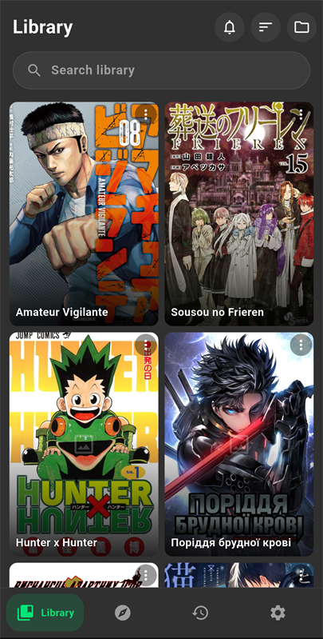 Library</td>
    <td align="center">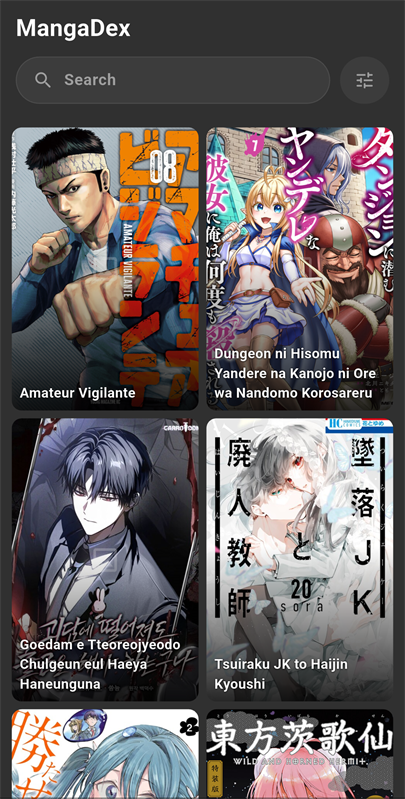 Browse a source</td>
    <td align="center"> Title details</td>
  </tr>
  <tr>
    <td align="center">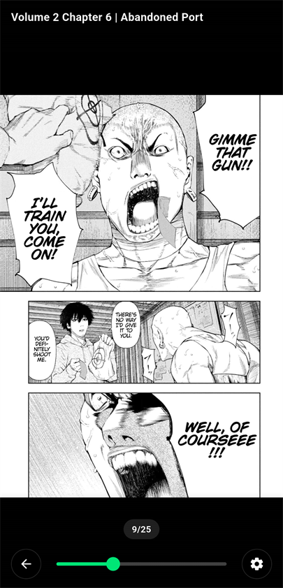 Chapter reader</td>
    <td align="center">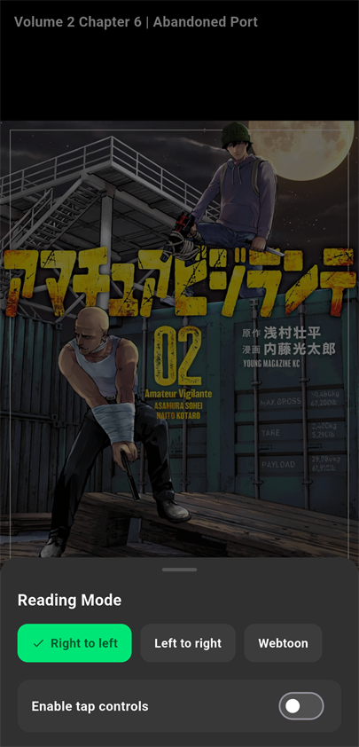 Reading modes</td>
    <td align="center">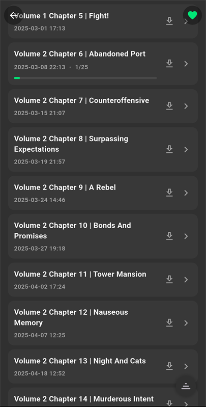 Chapters &amp; progress</td>
  </tr>
  <tr>
    <td align="center">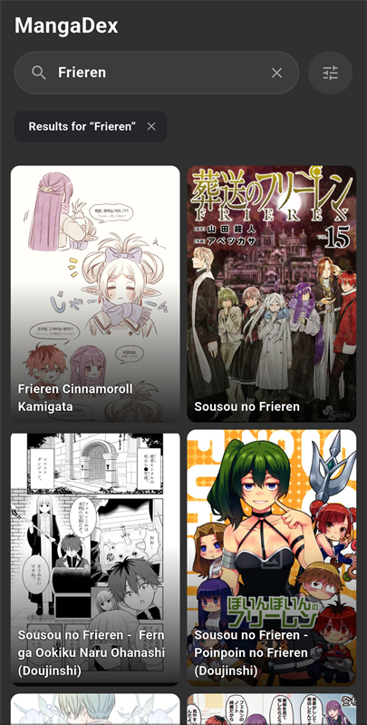 Search</td>
    <td align="center">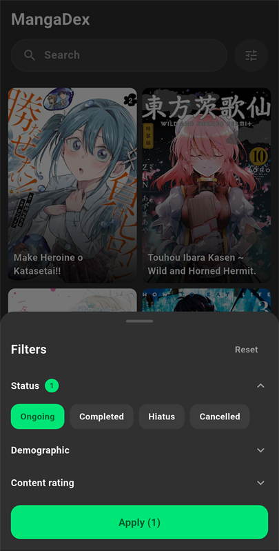 Source filters</td>
    <td align="center">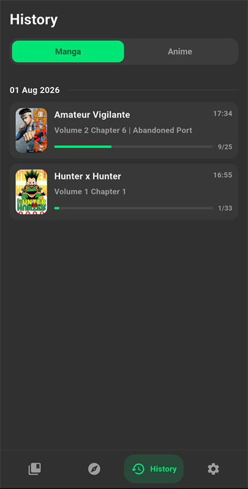 History</td>
  </tr>
  <tr>
    <td align="center"> Anime source</td>
    <td align="center">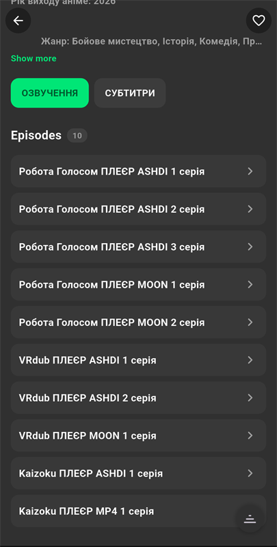 Episodes &amp; dub/sub</td>
    <td align="center">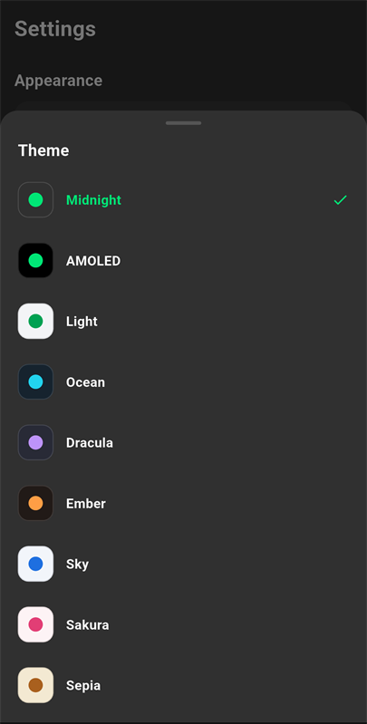 Nine themes</td>
  </tr>
  <tr>
    <td align="center">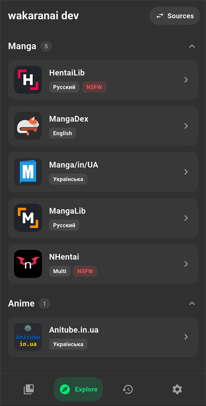 Extensions</td>
    <td align="center">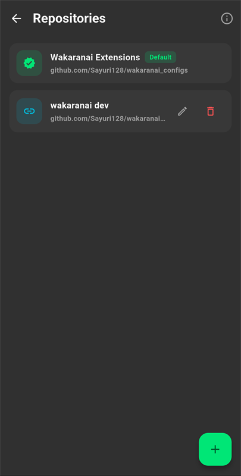 Repositories</td>
    <td align="center">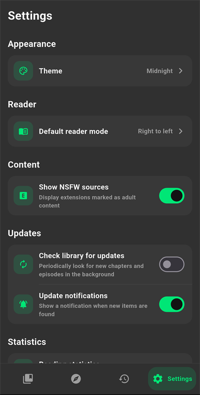 Settings</td>
  </tr>
</table>

## Features

- **Library** — bookmark titles, organise them into categories, search and sort your collection.
- **History** — separate manga and anime timelines, grouped by day, with per-chapter read progress.
- **Reader** — right-to-left, left-to-right and webtoon modes, optional tap controls, and a page
  slider. Controls sit at the bottom of the screen so the reader stays usable one-handed.
- **Downloads** — save chapters for offline reading.
- **Search &amp; filters** — per-source search plus filters exposed by the extension itself (status,
  demographic, content rating, and more), so each source offers whatever it actually supports.
- **Anime** — browse series, pick a dub or sub track and a player, and resume where you stopped.
- **Library updates** — periodic background checks for new chapters and episodes, with notifications.
- **Reading statistics** — see what you have been reading.
- **Nine themes** — Midnight, AMOLED, Ocean, Dracula and Ember (dark); Light, Sky, Sakura and Sepia
  (light).
- **Multiple extension repositories** — use the official one, or point the app at any GitHub repo
  (optionally a specific branch) to develop or host your own extensions.
- **Challenge handling** — sources behind Cloudflare-style checks are passed through an in-app
  browser that harvests the required headers and cookies.

## Capyscript

[**Capyscript**](https://github.com/Sayuri128/capyscript) is a small scripting language written for
Wakaranai to parse websites. It was built as a learning project to experiment with writing an
interpreter, and it lacks a proper architectural foundation — please be aware of its limitations.

## Create your own extension

See the guide for creating extensions [here](docs/guides/extensions.md).

By default Wakaranai fetches extension configurations from the
public [wakaranai_configs](https://github.com/Sayuri128/wakaranai_configs) repository, which also
serves as a reference for how extensions are structured. You can add your own repository from
**Explore → Sources**, and point it at a specific branch while you are iterating.

## Currently available extensions

* Manga
    * [MangaDex](https://mangadex.org/) (English only)
    * [MangaLib](https://mangalib.me/)
    * [MangaInUa](https://manga.in.ua/)
    * [HentaiLib](https://hentailib.me/)
    * [nhentai](https://nhentai.net/)
* Anime
    * [AnitubeInUa](https://anitube.in.ua/)

## Roadmap

- [x] **External repository integration** — add your own extension sources from inside the app.
- [x] **Library page with bookmarks** — organise saved titles into categories.
- [x] **User interface enhancements** — redesigned library, viewers, reader, history and settings.
- [ ] **Documentation** — comprehensive documentation for both Wakaranai and Capyscript.
- [ ] **Scripting language refinement** — address Capyscript's current limitations.
- [ ] **Bug fixes and optimisation** — continued performance and stability work.

## Disclaimer

Wakaranai and Capyscript are experimental projects developed for learning purposes. Documentation is
still limited; if you find the project interesting and would like to contribute or explore further,
please keep that in mind.

If you are interested in implementing Capyscript for a specific website and need assistance, I am
open to helping whenever time allows.
