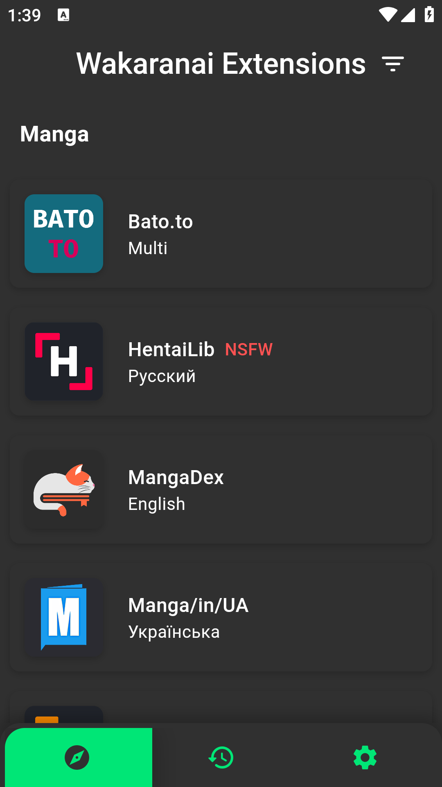

  

<h1 align="center">Wakaranai - Manga Reader App</h1>

Wakaranai is a manga reader app built with Flutter, designed to dynamically parse and fetch manga
content from various websites. The app utilizes a custom script language
called [Capyscript](https://github.com/Sayuri128/capyscript), which was developed as a learning
project to experiment with creating a simple interpreter without a proper architectural foundation.

####

<table>
  <tr>
      <td>
        
      </td>
      <td>
         
      </td>
      <td>
         
      </td>
  </tr>
  <tr>
    <td>
        
    </td>
    <td>
        
    </td>
    <td>
      
    </td>
  </tr>
</table>

## Capyscript

[**Capyscript**](https://github.com/Sayuri128/capyscript) is a basic scripting language implemented
within Wakaranai for parsing different websites. It's important to note that Capyscript lacks a
proper architecture and is considered a rudimentary implementation created solely for learning
purposes. Users are encouraged to be aware of its limitations.

## Disclaimer

Wakaranai and Capyscript are experimental projects developed for learning purposes. As of now, there
is no documentation available for the codebase. If you find this project interesting and would like
to contribute or explore further, please be aware that the current state lacks comprehensive
documentation.

## Create your own extension

See the guide for creating extensions [here](docs/guides/extensions.md).

## Future Development Roadmap
As the development of Wakaranai is just at the very beginning, here is an overview of the planned features and improvements that are currently in the pipeline:

### Top Priorities

- [ ] **Documentation**: Creating comprehensive documentation for both Wakaranai and the Capyscript language is the foremost priority. This will provide users with a clear understanding of the app's functionalities, the script language, and how to use them effectively.

- [ ] **Library Page with Bookmarks**: Introducing a Library Page within the app, featuring a robust bookmark system. This will allow users to organize and manage their favorite manga series for easy access.

### P2

- [ ] **User Interface Enhancements**: Improvements to the user interface for a more intuitive and seamless manga reading experience.

- [x] **External Repository Integration**: Implementing the ability for users to add external repositories within the app, giving them the freedom to explore a wider range of script sources.

- [ ] **Scripting Language Refinement**: Refining the Capyscript language to address its current limitations and provide a more robust and flexible scripting environment.

- [ ] **Bug Fixes and Optimization**: Identifying and addressing any reported bugs, as well as optimizing the app for better performance and responsiveness.

### Support:

If you are interested in implementing Capyscript for a specific website and need assistance, I am
open to providing help whenever time allows.
Your understanding and patience are appreciated as the project evolves. Thank you for your interest
in Wakaranai and Capyscript!

## Currently available Extensions

* Manga
    * [MangaDex](https://mangadex.org/) (English only)
    * [MangaLib](https://mangalib.me/)
    * [MangaInUa](https://manga.in.ua/)
    * [HentaiLib](https://hentailib.me/)
    * [nhentai](https://nhentai.net/)
    * [Bato.To](https://bato.to/)
* Anime
    * [AnitubeInUa](https://anitube.in.ua/)

For those interested in delving deeper into the project,
a [public repository](https://github.com/Sayuri128/wakaranai_configs) is available containing the
sources that I have personally used. This repository can serve as a reference 
for understanding the code structure and implementation details.

By default, Wakaranai fetches script configurations from the public repository mentioned above.

