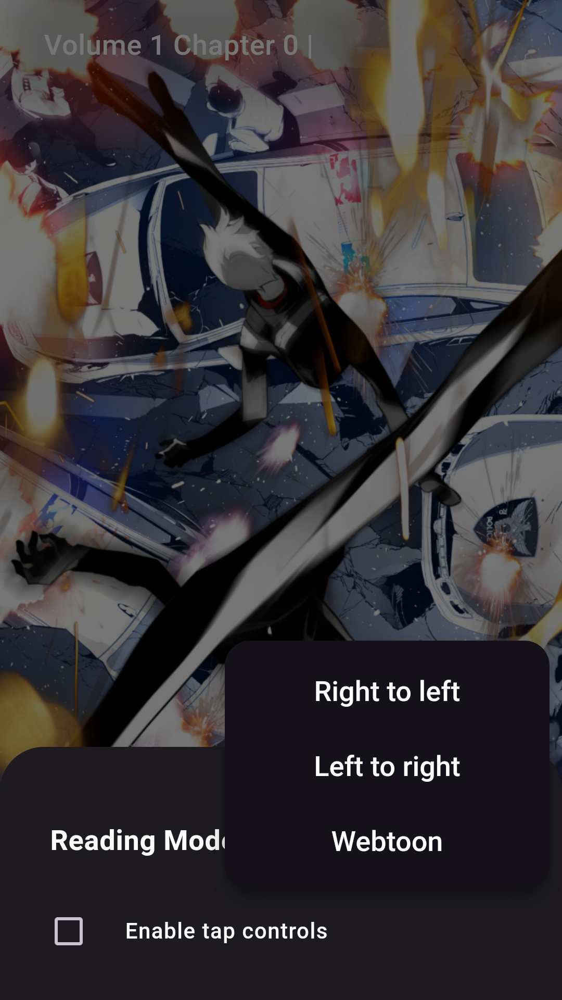

# Wakaranai - Manga Reader App

  
  

    Wakaranai is a manga reader app built with Flutter, designed to dynamically parse and fetch manga
    content from various websites. The app utilizes a custom script language
    called <a href="https://github.com/Sayuri128/capyscript">Capyscript</a>, which was developed as a learning
    project to experiment with creating a simple interpreter without a proper architectural foundation.

  

<table>
  <tr>
      <td>
        
      </td>
      <td>
         
      </td>
      <td>
         
      </td>
  </tr>
  <tr>
    <td>
        
    </td>
    <td>
        
    </td>
    <td>
      
    </td>
  </tr>
</table>

## Capyscript

[**Capyscript**](https://github.com/Sayuri128/capyscript) is a basic scripting language implemented
within Wakaranai for parsing different websites. It's important to note that Capyscript lacks a
proper architecture and is considered a rudimentary implementation created solely for learning
purposes. Users are encouraged to be aware of its limitations.

## Disclaimer

Wakaranai and Capyscript are experimental projects developed for learning purposes. As of now, there
is no documentation available for the codebase. If you find this project interesting and would like
to contribute or explore further, please be aware that the current state lacks comprehensive
documentation.

### Future Development:

The project will receive updates and documentation in the future when I have more time to work on it.
If you encounter issues or have suggestions, feel free to open an issue or contribute.

### Support:

If you are interested in implementing Capyscript for a specific website and need assistance, I am
open to providing help whenever time allows.
Your understanding and patience are appreciated as the project evolves. Thank you for your interest
in Wakaranai and Capyscript!

## Currently available Extensions

* Manga
  * [MangaDex](https://mangadex.org/)
  * [MangaLib](https://mangalib.me/)
  * [MangaInUa](https://manga.in.ua/)
  * [HentaiLib](https://hentailib.me/) 
  * [nhentai](https://nhentai.net/)
* Anime
  * [AnitubeInUa](https://anitube.in.ua/) 

## Capyscript Features

* HTTP Requests: Capyscript provides different types of HTTP requests, allowing the app to fetch
  manga content from various websites.
* HTTP Library and Headless WebView: Users can choose between using the HTTP library or a headless
  web view for fetching content. This is particularly useful for accessing protected sites or those
  requiring authorization.
* JS Code Execution: Capyscript allows users to execute JavaScript code within the embedded browser,
  offering flexibility for handling dynamic content.

For those interested in delving deeper into the project,
a [public repository](https://github.com/Sayuri128/wakaranai_configs) is available containing the
sources that I have personally used for an extended period. This repository can serve as a reference
for understanding the code structure and implementation details.

By default, Wakaranai fetches script configurations from the public repository mentioned above.
However, to enhance flexibility and customization, there are plans to implement a feature allowing
users to add external repositories directly within the app. This functionality is on the roadmap and
will be added to the app as soon as possible.

The main script, `main.capyscript`, requires a `config.json` file with the following structure:

* `uid`: Unique identifier for the script.
* `name`: Name of the script.
* `logoUrl`: URL to the script's logo.
* `type`: Type of script, either "MANGA" or "ANIME".
* `nsfw`: Indicates whether the script contains NSFW content (true or false).
* `language`: Script language.
* `version`: Version number of the script.
* `protectorConfig`: Configuration for the protector.
    * `pingUrl`: URL for ping.
    * `needToLogin`: Indicates whether login is required (true or false).
    * `inAppBrowserInterceptor`: Indicates whether to use in-app browser interceptor (true or
      false).
* `searchAvailable`: Indicates whether search functionality is available (true or false).

### Minimal Required Implemented Functions in `main.capyscript`

The `main.capyscript` file should implement the following functions:

* `getGallery`
* `getPages`
* `getConcrete`
* `getImageHeaders`
* `passProtector`

**Note**: More detailed guidance on implementing these functions will be provided once time allows.
For any immediate assistance or questions, feel free to reach out.
