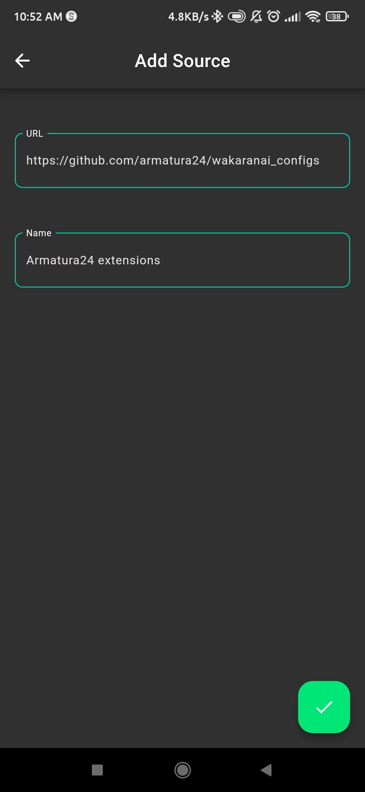
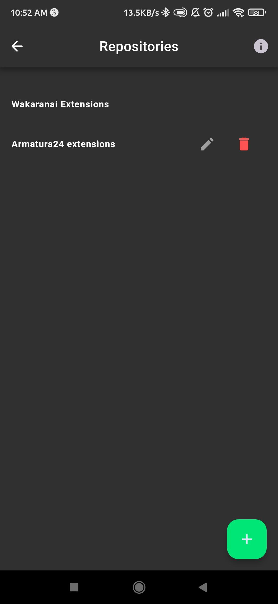

# External Extension Sources

You can add external repositories to Wakaranai.

You just need to add a URL to repository that contains the extensions in the following structure:

```
├── manga
│   ├── extension1
│   │   ├── config.json
│   │   └── main.capyscript
│   ├── extension2
│   │   ├── config.json
│   │   └── main.capyscript
├── anime
│   ├── extension1
│   │   ├── config.json
│   │   └── main.capyscript
│   ├── extension2
│   │   ├── config.json
│   │   └── main.capyscript
```

<table>
  <tr>
      <td>
        
      </td>
      <td>
         
      </td>
      <td>
         
      </td>
  </tr>
</table>

See guide for creating extensions [here](../guides/extensions.md)
