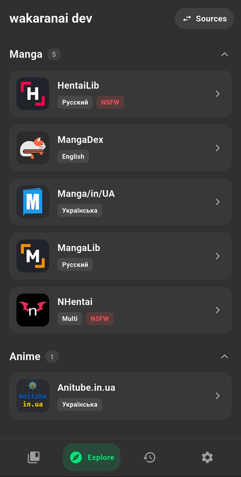
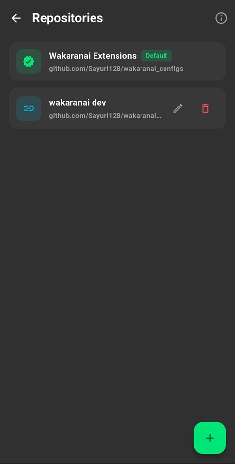
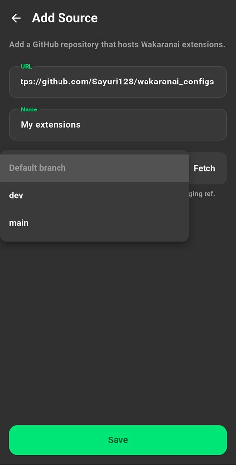

# External Extension Sources

Wakaranai loads every source from a GitHub repository at runtime, so you can point the app at your
own repository instead of (or alongside) the official one.

## Adding a repository

Open **Explore → Sources**, tap the **+** button, and fill in:

* **URL** — the GitHub repository, e.g. `https://github.com/Sayuri128/wakaranai_configs`
* **Name** — how the repository is labelled in the app
* **Branch** *(optional)* — tap **Fetch** to load the repository's branches and pick one. Leave it on
  *Default branch* for normal use; select a branch when you want to test extensions on a staging ref
  before merging them.

Saved repositories appear in the same list. Tap one to switch the Explore page to it, or use the
pencil and trash icons to edit or remove it. The official **Wakaranai Extensions** repository is
always listed first and cannot be removed.

<table>
  <tr>
      <td>
        
      </td>
      <td>
         
      </td>
      <td>
         
      </td>
  </tr>
</table>

## Repository structure

The repository needs `manga` and/or `anime` directories, with one directory per extension
containing a `config.json` and a `main.capyscript`:

```
├── manga
│   ├── extension1
│   │   ├── config.json
│   │   └── main.capyscript
│   ├── extension2
│   │   ├── config.json
│   │   └── main.capyscript
├── anime
│   ├── extension1
│   │   ├── config.json
│   │   └── main.capyscript
```

## Optional: index.json

If a file named `index.json` exists at the root of the repository, the app reads it instead of
listing directories through the GitHub API. This is a single request rather than one per extension,
so it loads faster and is much less likely to hit GitHub's rate limit for unauthenticated requests.

```json
{
  "schemaVersion": 1,
  "configs": [
    {
      "category": "manga",
      "path": "manga/extension1",
      "config": { "...contents of config.json..." }
    }
  ]
}
```

If `index.json` is missing, the app falls back to scanning the `manga` and `anime` directories, so
it is entirely optional — just keep it in sync with the configs when you add or update an extension.

See the guide for creating extensions [here](../guides/extensions.md).
